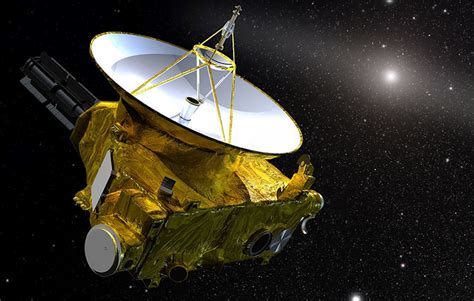

# New Horizons

  

Experimental server for testing new services, configurations, and ideas.

## Role

Hostname: newhorizons
Location: Remote
Purpose: Experiments

## Services

TBD

## Notes

Named after NASA's New Horizons spacecraft, which explored Pluto and continues into the Kuiper Belt.

Mission: [NASA — New Horizons](https://science.nasa.gov/mission/new-horizons/)
