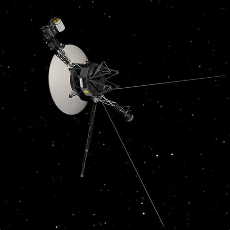

# Voyager

  

Remote server for services that need to be accessible from outside the home network.

## Role

Hostname: voyager
Location: Remote
Purpose: External services

## Services

TBD

## Notes

Named after NASA's Voyager spacecraft, which operates far beyond the outer planets.

Mission: [NASA — Voyager](https://science.nasa.gov/mission/voyager/)
